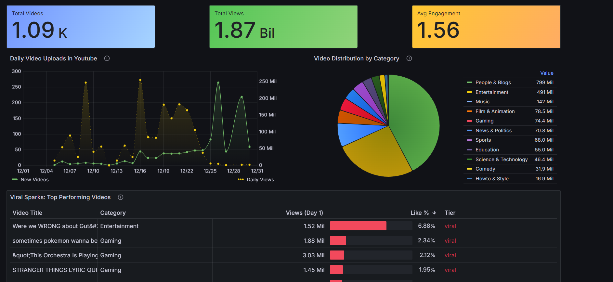

# 🎥 YouTube Analytics Pipeline

**From YouTube API to Real-Time Analytics Dashboards**

End-to-end data engineering project that ingests YouTube data, processes it with modern ELT tooling, and visualizes insights in Grafana.

---

## 🚀 Project Overview

This project builds a **full analytics pipeline** for YouTube videos:

- 📡 Collects raw data from **YouTube Data API**
- 🛠 Orchestrates ingestion with **Apache Airflow**
- 🗄 Stores raw data in **PostgreSQL**
- 🔄 Transforms data using **dbt**
- ⚡ Serves analytics at scale via **ClickHouse**
- 📊 Visualizes insights in **Grafana dashboards**

The goal is to analyze:

- daily video uploads
- engagement metrics
- category distributions
- viral content dynamics
- trends over time

---

## 🧱 Tech Stack

| Layer             | Technology              |
| ----------------- | ----------------------- |
| Ingestion         | YouTube Data API        |
| Orchestration     | Apache Airflow          |
| Raw Storage       | PostgreSQL              |
| Transformation    | dbt                     |
| Analytics Storage | ClickHouse              |
| Visualization     | Grafana                 |
| Infrastructure    | Docker & Docker Compose |

---

## 📡 Data Ingestion (Airflow)

- **Daily scheduled DAG** (`@daily`)
- Uses Airflow `logical_date` for correct backfilling
- Fetches:
  - video metadata
  - statistics (views, likes, comments)
  - categories, duration, captions, topics

---

## 🗄 Raw Layer (PostgreSQL)

PostgreSQL stores **raw, immutable data**:

- minimal transformations
- original payload preserved
- acts as a system of record

This layer is optimized for:

- reliability
- reprocessing
- schema evolution

---

## 🔄 Transformations (dbt)

The dbt project follows **analytics engineering best practices**:

```
models/
├── staging/        -- cleaned & typed sources
├── intermediate/  -- business logic & derivations
└── marts/          -- analytics-ready models
```

### Modeling Strategy

- **staging**: renaming, casting, light cleanup
- **intermediate**: daily metrics, enrichments, deltas
- **marts**:
  - `dim_youtube_video`
  - `fct_youtube_daily_metrics`
  - trend & rolling-average tables

✨ Includes:

- dbt tests
- sources
- clear naming conventions (dim / fct)

---

## ⚡ Analytics Layer (ClickHouse)

ClickHouse is used for **high-performance analytics**:

- column-oriented storage
- fast aggregations
- optimized for time-series workloads

All analytics tables are created via **dbt**, ensuring:

- reproducibility
- version control
- zero manual DDL

---

## 📊 Grafana Dashboards

Interactive dashboards built on top of ClickHouse:

### 📌 KPI Cards

- **Total Videos**
- **Total Views**
- **Average Engagement**

### 📈 Time Series

- **Daily uploads on YouTube**
- Trend analysis over time

### 🥧 Category Distribution

- Video share by category
- Content landscape overview

### 📋 Tables

- **Viral Sparks** — top performing videos
- Ranked by views & engagement

## 

## 🎯 What This Project Demonstrates

✅ Real-world ELT architecture  
✅ Proper Airflow scheduling & backfills  
✅ Idempotent data ingestion  
✅ dbt modeling best practices  
✅ ClickHouse analytics patterns  
✅ BI dashboards for business users

This is **not a tutorial pipeline**, but a realistic analytics system.

---

## 🧠 Possible Extensions

- Incremental dbt models
- Engagement growth trends (Δ views/day)
- Rolling averages (7d / 14d)
- Topic-based clustering
- Alerting in Grafana
- Kafka for streaming ingestion

---

## 🏁 Final Notes

This project showcases **end-to-end data engineering skills**, from API ingestion to analytics and visualization.
